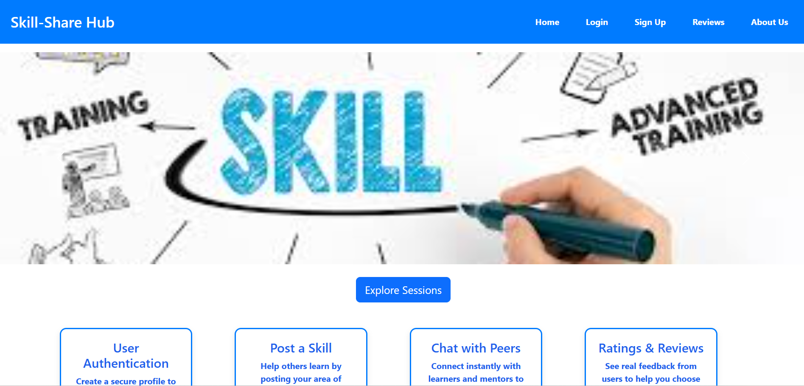

# 💡 Skill-Share Hub

Skill-Share Hub is a web platform where **students** and **staff** collaborate through skill-based sessions, posts, and chats. Staff can share knowledge, schedule events, and interact with students, while students can explore opportunities and participate actively.

---

##  Features

###  For Staff:
- Create skill-sharing posts
- Schedule learning sessions
- Chat with students or leave messages

###  For Students:
- View posts and available sessions
- Join skill sessions or workshops
- Chat or leave questions for staff

###  Common:
- Role-based authentication (`Staff` / `Student`)
- JWT-secured login/signup system
- Responsive UI with Bootstrap
- Skill cards with edit/view/delete options

---

##  Tech Stack

- **Frontend:** HTML, CSS, Bootstrap, JavaScript
- **Backend:** Node.js, Express.js
- **Database:** MongoDB with Mongoose
- **Authentication:** bcryptjs & JSON Web Token (JWT)

---

## Screenshot

